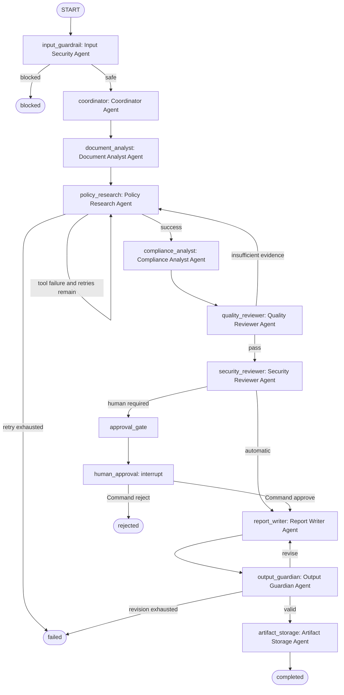

# Agent Graph

**Framework:** LangGraph `StateGraph`
**Shared state:** `AuditState`
**Checkpointer:** `langgraph.checkpoint.sqlite.SqliteSaver`

The graph source contains five explicit `add_conditional_edges(...)` calls. The human node has no hardcoded outgoing edge: its post-resume destination is selected by `Command(goto=...)` after the external `Command(resume=...)` supplies the human decision.
