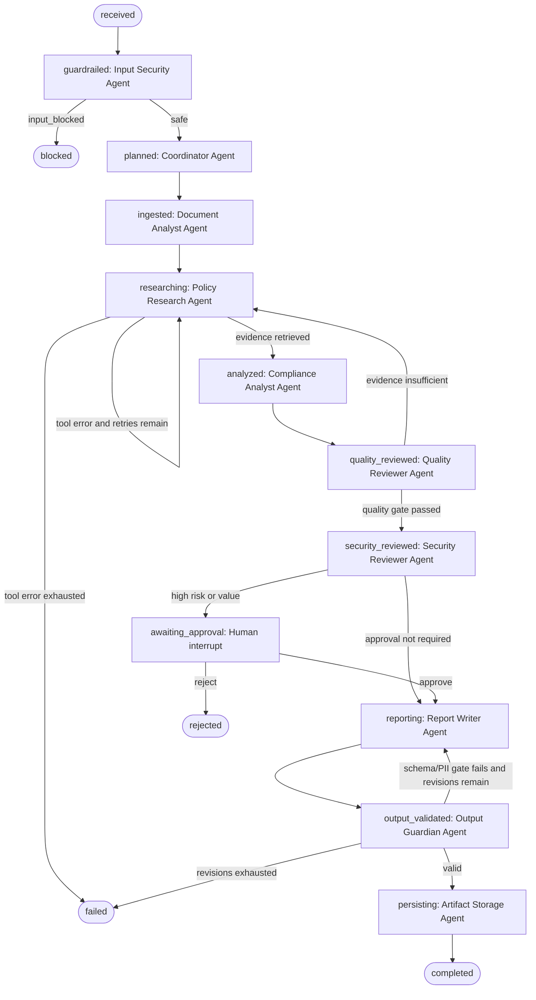

# ContractGuard AI State Graph

GitHub renders the Mermaid diagram below directly. Every box is an executable graph node;
labels on arrows are framework-managed conditions or human commands.

**Framework:** `transitions.Machine` 0.9.3. The machine configuration is serialized to
`evidence/graph_spec.json` with package/version, nodes, edges, conditions, and loops.

## Bounded-cycle controls

| Loop | Exit condition |
|---|---|
| Policy tool retry | Success or `MAX_POLICY_RETRIES` exhausted |
| Reflexion/re-search | Evidence coverage passes or `MAX_QUALITY_RETRIES` exhausted |
| Report revision | Pydantic output schema passes or `MAX_REPORT_REVISIONS` exhausted |
| Whole workflow | Terminal/pause node or `MAX_GRAPH_STEPS` safety stop |

The serializable shared state is checkpointed to SQLite after every framework transition.
