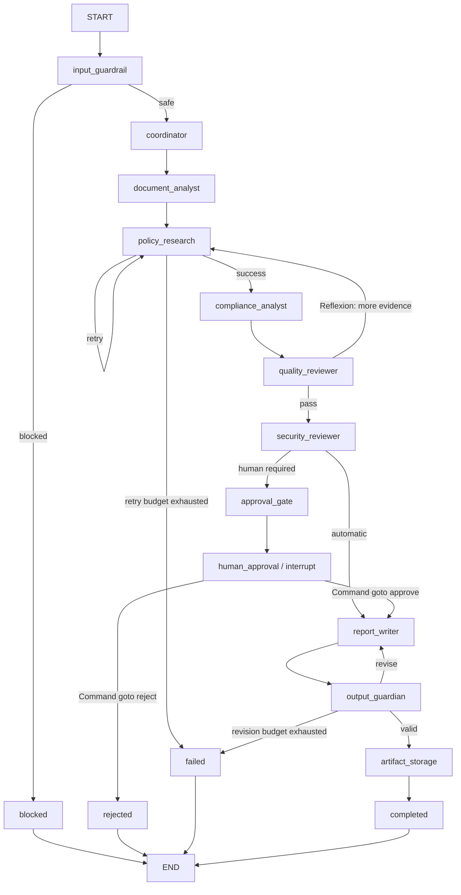

# Architecture

ContractGuard AI v1.3.1 is a stateful, centralized multi-agent application built around a real LangGraph `StateGraph`. The graph controls execution; specialist agent objects perform the domain work; a typed `AuditState` is the shared memory moved between nodes.

## Core components

- **Nodes:** executable graph functions such as `input_guardrail`, `policy_research`, `quality_reviewer`, `human_approval`, and `output_guardian`.
- **Edges:** normal transitions plus five explicit `add_conditional_edges(...)` routing tables.
- **State:** `AuditState`, shared across graph steps and persisted by the checkpointer.
- **Agents:** independently instantiated role-specialist classes under `src/contractguard/agents/`.
- **Tools:** six strict schema-described local functions exposed through the tool registry.
- **Persistence:** `langgraph.checkpoint.sqlite.SqliteSaver` compiled directly into the graph.
- **HITL:** `interrupt(...)` pauses the graph and `Command(resume=...)` resumes the same thread.
- **Observability:** JSONL logs plus Prometheus counters, gauges, and histograms.

## Execution graph

## Conditional routing and bounded loops

The graph contains five calls to `StateGraph.add_conditional_edges` in executable code. Runtime evidence also introspects the actual `StateGraph.branches` registry and records the registered branch sources/count in `evidence/graph_spec.json`; the proof is therefore not derived only from a hand-written diagram. The cycles are bounded by `MAX_POLICY_RETRIES`, `MAX_QUALITY_RETRIES`, `MAX_REPORT_REVISIONS`, and the global `MAX_GRAPH_STEPS` recursion limit. This gives the system error recovery and self-critique without an unbounded autonomous loop.

## Multi-agent coordination

The explicit coordination strategy is centralized/hierarchical delegation. The Coordinator establishes the plan, while document, policy, compliance, quality, security, reporting, output-safety, and storage specialists perform bounded responsibilities. Agents exchange typed `AgentMessage` records through the shared state rather than changing personas in one prompt.

## Security boundaries

The first tool-reachable path is guarded by `InputGuardrail.enforce()`. If an indirect or direct injection pattern is detected, `GuardrailViolation` is raised inside the Input Security Agent and the conditional edge routes to `blocked`; no function tool is executed. The final artifact is inaccessible to the storage node until `OutputGuardrail.enforce()` has completed PII masking and strict report-schema validation.

## Persistence and HITL

The compiled graph uses a durable SQLite `SqliteSaver`. A high-risk audit enters `human_approval`, where `interrupt(...)` stores the interruption in the same thread. A new `ContractGuardService` can open the same database after the first service has closed, retrieve the pending graph state, and resume with `Command(resume={...})`.
