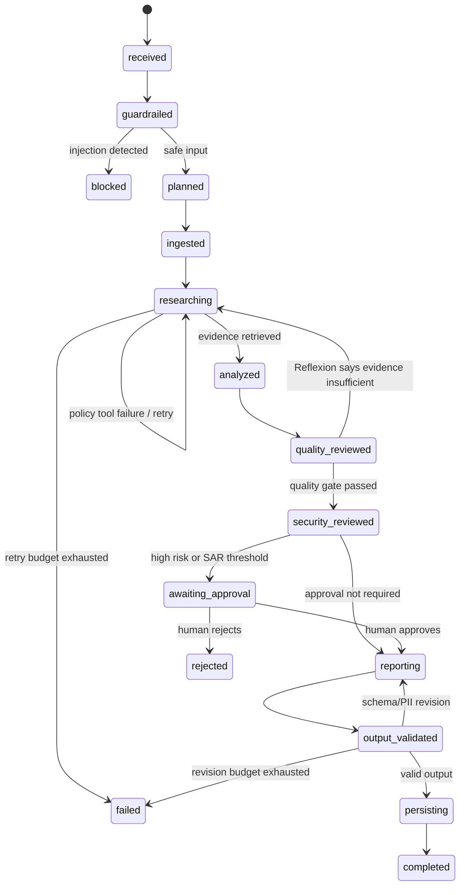

# ContractGuard AI Architecture

## 1. System purpose

ContractGuard AI audits vendor contracts against corporate policies, calculates risk,
blocks malicious instructions, pauses high-risk decisions for human approval, masks PII,
and stores a validated compliance report. It is an enterprise-oriented **multi-agent
state graph**, not a single prompt or a linear script.

## 2. Architectural vocabulary

- **State:** one shared JSON-serializable object (`graph_state`) containing the request,
  contract, plan, clauses, policy evidence, findings, retry counters, agent messages,
  tool calls, approval record, report, and artifact metadata.
- **Nodes:** bounded actions such as `guardrailed`, `planned`, `researching`,
  `quality_reviewed`, and `awaiting_approval`.
- **Edges:** framework-managed transitions. Conditions inspect shared state and decide
  which edge is legal.
- **Agents:** separate Python objects with one named responsibility. They communicate by
  writing typed `AgentMessage` objects to shared state.
- **Tools:** strict JSON-schema-described functions exposed by `ToolRegistry`, an
  MCP-style function interface.
- **Checkpoints:** SQLite snapshots saved after every edge, including ordered checkpoint
  history for replay and restart recovery.

## 3. State graph and real orchestration framework

The implementation in `src/contractguard/workflow.py` uses the established
`transitions.Machine` finite-state-machine library, pinned to version 0.9.3. States are
executable nodes, transitions are edges, condition callbacks provide branching, and
back/self edges provide cycles. The serializable graph specification records the package,
version, node/edge counts, branching nodes, loops, and termination controls in
`evidence/graph_spec.json`. This is a framework-managed state graph rather than a
hand-written `if/else` chain.

The three bounded cycles are:

1. policy tool failure → retry the `researching` node;
2. insufficient evidence → Reflexion route from `quality_reviewed` back to research;
3. failed output schema → return from `output_validated` to `reporting`.

`MAX_GRAPH_STEPS` supplies a final circuit breaker in addition to loop-specific budgets.

## 4. Agents and role specialization

| Agent | Responsibility | Allowed function tools |
|---|---|---|
| Input Security Agent | Direct/indirect prompt-injection detection | None |
| Coordinator Agent | Plan-and-Execute decomposition and coordination | None |
| Document Analyst Agent | File/PDF ingestion, metadata, clause extraction | `read_contract`, `extract_contract_clauses` |
| Policy Research Agent | Schema-routed corporate-policy retrieval | `search_policy_knowledge_base` |
| Compliance Analyst Agent | Clause-to-policy comparison and findings | None |
| Quality Reviewer Agent | Reflexion/self-critique and coverage scoring | None |
| Security Reviewer Agent | Risk calculation and HITL routing | `calculate_contract_risk` |
| Report Writer Agent | Structured report and optional model summary | None |
| Output Guardian Agent | Schema validation, secret filter, PII masking | None |
| Artifact Storage Agent | MinIO/S3 or filesystem persistence | `store_report_artifact` |

Coordination is **centralized/hierarchical**: the Coordinator creates the plan, while
specialists report through typed messages and shared state. Tool permissions are enforced
at runtime in `BaseAgent.call_tool`; an unauthorized specialist receives a hard denial and
a structured `tool_permission_denied` event.

## 5. Reasoning patterns

1. **Plan-and-Execute:** the Coordinator creates a seven-step typed plan before tools run.
2. **ReAct:** each function call records a concise auditable rationale (`Thought`), the
   function invocation (`Action`), and the typed result (`Observation`). The rationale is
   a decision summary, not private hidden chain-of-thought.
3. **Reflexion/self-critique:** the Quality Reviewer calculates evidence coverage and can
   route the graph back to research.
4. **Hierarchical delegation:** the Coordinator delegates to role-specialized agents and
   aggregates their shared state.

## 6. Function calling and MCP-style tool interface

Six functions expose a name, description, and Pydantic-generated JSON Schema. Tool input
models use `extra="forbid"`, so undeclared model-generated fields are rejected.

| Tool | Real action |
|---|---|
| `read_contract` | Reads allowed PDF/TXT/Markdown paths or bounded inline text |
| `extract_contract_clauses` | Parses and classifies contract clauses |
| `search_policy_knowledge_base` | BM25-style retrieval over Markdown policy files |
| `calculate_contract_risk` | Computes a bounded risk score and approval requirement |
| `mask_pii` | Masks Saudi IDs, phones, IBANs, email, and card numbers |
| `store_report_artifact` | Writes to MinIO/S3 or the durable filesystem fallback |

The default `offline` reasoner selects the policy-search function through the same
schema-described MCP-style interface and is fully reproducible without a secret. Optional
Gemini, OpenRouter, and Groq adapters perform provider-native function calling. Application
code locks security-sensitive arguments such as topic, retry number, simulation flag,
paths, approvals, and persistence destinations.

Every invocation produces a `ToolCall`, a `ToolObservation`, latency metrics, and a
structured log event. Routing metadata records the decision source, protocol, provider,
model, and whether a live model was used.

## 7. Security and data boundaries

- **Input guardrail:** scans both the user request and untrusted document content before
  any registered function is invoked.
- **Path boundary:** contract files must be beneath `CONTRACT_ALLOWED_ROOTS`; the default
  is the project `data/` directory. The service and read tool both enforce it.
- **Identifier boundary:** thread identifiers are length-bounded and restricted to safe
  characters, preventing artifact-path traversal.
- **Input limits:** request, path, inline text, file size, and tool arguments are bounded.
- **Least privilege:** each specialist has a runtime function allow-list.
- **External-model minimization:** optional model summaries receive no raw contract
  excerpts; only the minimum finding fields are sent, and PII is masked first.
- **Output/data protection:** the complete report is recursively PII-masked, checked for
  secret-like values, and validated against a strict Pydantic schema.
- **HITL safety:** high risk or value at/above SAR 500,000 pauses at a durable approval
  node before completion.
- **API protection:** setting `CONTRACTGUARD_API_KEY` requires `X-API-Key` on all audit
  creation, inspection, history, and resume endpoints.

## 8. Persistence and restart recovery

`SQLiteCheckpointer` uses WAL mode and `synchronous=FULL`. It stores both the latest
checkpoint and an append-only ordered history after every graph transition. Resume
requires the same `thread_id`. The demonstration deliberately closes one service at the
approval pause, constructs a new service against the same database, reloads the state,
applies a human decision, and continues from the paused node.

## 9. Observability

Structured JSONL logs capture node starts/completions/failures, tool calls and denials,
latency, model calls/fallbacks, guardrail events, retries, human interrupts/decisions,
checkpoints, and terminal outcomes.

Prometheus metrics expose node/tool/model counters and latency histograms, token estimates,
guardrail blocks, retries, HITL interrupts, workflow outcomes, and active workflows. The
API serves them at `/metrics`.

## 10. Production and simulated-cloud deployment

- FastAPI endpoints for start, inspect, history, resume, graph, health, and metrics.
- Non-root Docker image with a health check.
- Hardened Compose service with read-only root filesystem, dropped Linux capabilities,
  `no-new-privileges`, bounded `/tmp`, and persistent evidence volume.
- MinIO/S3-compatible storage plus Prometheus.
- GitHub Actions jobs that reproduce evidence and run a real API-to-MinIO smoke test.
- Environment-driven configuration loaded from process variables or an untracked `.env`.
- Deterministic offline mode plus optional live Gemini, OpenRouter, or Groq adapters.
